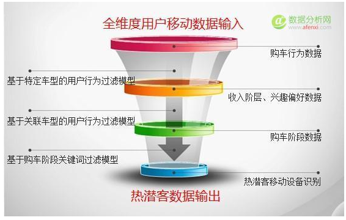
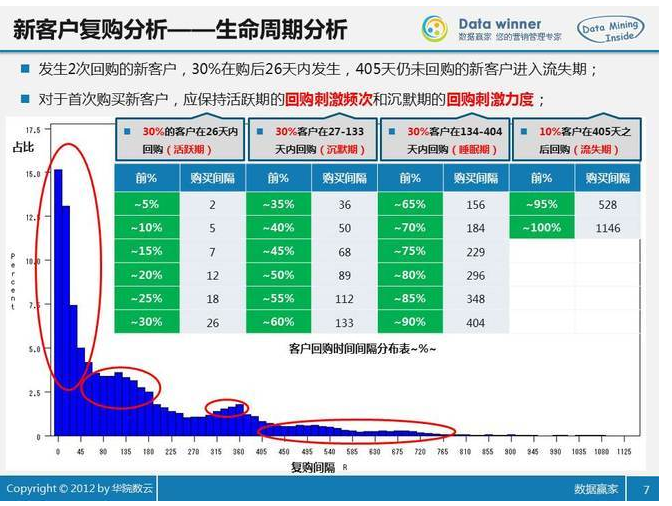
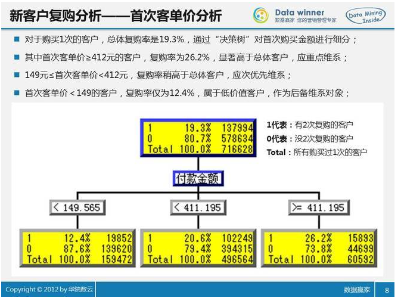

- 一、用户行为分析的目的
 1. 1） 新产品迭代开发：通过分析用户行为，定位目标用户人群，通过用户画像等手段找到用户需求，开发新产品；
 2. 2）精准营销：产品已经有啦，是不是要分析分析用户的行为，找找我们的潜在用户，针对特定群体来进行营销。比如判断你有小孩，就可以推荐母婴产品；
 3. 3）数据挖掘：最常见的聚类分析对用户进行细分，关联分析的一个典型例子：购物篮分析。通过发现顾客放入其购物篮中的不同物品之间的联系，分析顾客的购买习惯。通过了解哪些产品频繁地被顾客同时购买，这种关联的发现可以帮助制定营销策略。也就是喜欢什么东西的人往往喜欢什么；做了这个事的人一般接下来会做什么。啤酒&尿布；
 4. 4）个性化服务：根据购买历史推荐商品等等。
目的不同，用户行为分析所侧重的点也不同。

- 漏斗模式

参考网址：[数据模型在电商CRM中的应用](http://www.199it.com/archives/52221.html)

落脚点：复购率

落脚点：提升客户的消费并实现二次购买。

潜在客户发现

CRM系统提升销售，不仅是为了实现客户的二次购买，还为了提升客户的客单价、消费频次、客户忠诚度、满意度，实现口碑营销，真正做到以客户为中心，想他们之所想，做他们想不到的事情，让他们成为您的免费宣传员。

1.你去A餐厅吃饭，服务员推荐你办了一张会员卡，于是你进入了A餐厅的会员数据库，于是CRM的基础——客户数据就有了。2.A餐厅根据会员的交易数据分析，发现多数会员在初次消费后30天内会有第二次消费，30天内没来消费的客户有流失风险。这是CRM数据分析。3.你在30天内没再去A餐厅，于是在第31天你收到了A餐厅发给你的短信，送你20元代金券。你本来觉得A餐厅味道还可以，正好又想外出吃饭，就临时决定不去B餐厅而去A餐厅用掉这优惠。这是CRM营销。4.你到A餐厅点了200块钱的菜，用了20块钱的优惠券。扣掉优惠券和菜品成本，A餐厅收到的180块钱里大概有100块的毛利20块的纯利。这就通过CRM挣到钱了。5.又经过几次优惠券拉动你到A餐厅消费，逐渐你发现A餐厅知道你喜欢什么菜品，喜欢坐哪个位置，有新菜上市还邀请你免费品尝。于是你原来每个月在外面吃饭10次都会换餐厅，现在变成了10次有5次在A餐厅。这就是CRM维护的忠诚客户，从每月赚你1次钱增加到赚你5次钱。至于RFM，CLV啊什么的，有兴趣我们再聊？
