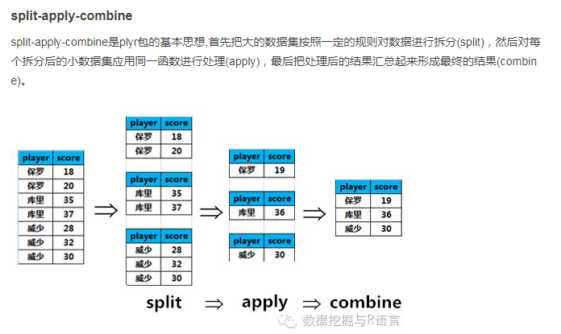

# R语言基础包
数据预处理流程：
* 检查数据：变量分布，是不是存在错误的观测
* 缺失值填补：了解缺失原因，选择填补方式
* 数据变换：取决于需要建立的模型，对不符合正态分布假设，变量尺度差异大，有离群值的数据进行变换
* 检查共线性：找到高度线性相关的变量，决定删除变量，还是使用PCA，CFA这类非监督方法得到不相关的变量线性组合
* 稀疏变量：查找并且删除稀疏变量
* 编码名义变量：对于不能作用于分类变量的模型，将分类变量转化成0/1名义变量


<!-- toc orderedList:0 depthFrom:1 depthTo:6 -->

* [R语言基础包](#r语言基础包)
  * [加载数据(数据读取)](#加载数据数据读取)
    * [加载csv数据](#加载csv数据)
    * [加载xlsx数据](#加载xlsx数据)
    * [读取MYSQL数据库](#读取mysql数据库)
    * [数据处理包](#数据处理包)
    * [画图包](#画图包)
  * [数据清理](#数据清理)
    * [缺失值填补](#缺失值填补)
      * [数据变换](#数据变换)
        * [中心化和标量化 (这是最基本的)](#中心化和标量化-这是最基本的)
      * [处理离群点](#处理离群点)
      * [共线性](#共线性)
      * [稀疏变量](#稀疏变量)
      * [编码名义变量](#编码名义变量)
      * [数据整合和整形](#数据整合和整形)

<!-- tocstop -->


## 加载数据(数据读取)
请优先参考《R语言实战》关于数据的输入章节
### 加载csv数据
```r
filepath <- "c:/users/acer/desktop/gh20160926.csv"
table <- read.csv(filepath,header=T,stringsAsFactors = FALSE)
```
### 加载xlsx数据
xlsx数据包安装
1. [把excel文件直接读入R语言](http://cos.name/cn/topic/132031/)
http://cos.name/cn/topic/132031/
2. 安装JAVA软件 [JDK安装与环境变量配置](http://jingyan.baidu.com/article/6dad5075d1dc40a123e36ea3.html)

3. 示例
```r
R读取excel
workbook='c:/users/acer/desktop/text.xlsx '
data11=read.xlsx('c:/users/acer/desktop/text.xlsx',sheetName='Sheet1',encoding ='UTF-8')
```
4. 温馨提醒：
excel表有中文的时候，encoding = 'UTF-8',必须是UTF-8，否则是乱码

### 读取MYSQL数据库

已知R语言提供两种连接数据库，一种是RODBC，一种是RMySQL，
可使用RODBC连接，因RODBC需要设置，有点麻烦哈，请参考R语言实战，；
以下范例是 使用RMySQL连接的

```R
##R语言用RMySQL 链接数据库
##数据库名是中文的暂时无法连接，请使用RODBC连接
#install.packages('RMySQL')
library('RMySQL')
con <- dbConnect(MySQL(),user='step',password='123456',dbname='db_test',host='172.16.57.72',port= 3306)
dbSendQuery(con,"SET NAMES gbk")
table.names=dbListTables(con)
table.names
query =dbSendQuery(con,"select 日期,访客数,浏览量,成交金额,客单价 from 运营明细表 ")
table <- fetch(query)
```
* 温馨提示：
数据库有中文表名的时候，需要设置 $dbSendQuery(con,"SET NAMES gbk")
* 参考文献：
1.  [R语言-连接MySQL数据库方法](http://blog.csdn.net/hongweigg/article/details/49779943)
2. 《R语言实战》

### 数据处理包
1. dplyr(优先推荐)
[使用 dplyr 包进行数据操作与清洗](http://blog.csdn.net/songzhilian22/article/details/50326151)

数据处理神器， plyr的升级版，主要用于数据框，可以实现与数据的快速交互。

2. plyr
dplyr 是 plyr的升级版本，建议优先掌握dplyr
plyr包是Hadley Wickham大神为解决split – apply – combine问题而写的一个包，其动机在与提供超越for循环和内置的apply函数族的一个一揽子解决方案。使用plyr包可以针对不同的数据类型，在一个函数内同时完成split – apply – combine三个步骤。

[数据处理](http://www.10tiao.com/html/408/201608/2247483761/1.html)
这篇文章主要看思想：数据处理思维方式(split-apply-combine)


温馨提醒：
plyr 轻松地在vector, list, data.frame之间做分组变换，实现拆分、变换、合并的操作；
尽量使用dplyr做数据处理，少用或者不用plyr做数据处理，dplyr继承了plyr的精髓，操作更方便；
数据操作神器,对apply, sapply的升级版, 加入了进度条,并行操作.

3. reshape2，tidyr 数据变换
data.frame数据的重构、变换；(通俗说：行列变换；)


### 画图包
1. ggplot2
2. ggplotly()
[利用R语言进行交互数据可视化](https://zhuanlan.zhihu.com/p/23427542)

## 数据清理

1. 通过summary()函数检查清理情况
###  缺失值填补
填补之前
1. 了解缺失的原因
2. 建模的目的：解释和推断 v.s 预测
缺失值填补方法
1. 中位数或众数填补
* imputeMissings包中的函数impute()
* preProcess()函数
2. K-近邻填补
* 物以类聚”这一思想的统计学表达
* K-近邻方法建立在距离的定义之上（通常时欧几里德距离）
* preProcess()实现
* 注意：算法无法对整行缺失的观测进行填补
#### 数据变换
##### 中心化和标量化 (这是最基本的)
1. 手动进行
2. 用caret包中的函数preProcess()对多个变量同时进行中心化和标量化
3. 数据变换：Box-Cox变换
#### 处理离群点
1. 可视化
2. Z分值
#### 共线性
1. corrplot()可视化
2. 删除高度相关变量：caret中的findCorrelation()函数
#### 稀疏变量
* 通常识别这样的变量有两个法则：
* 不同取值数目和样本量的比值
* 最常见的取值频数和第二常见的取值频数之间的比值
* caret包中的nearZeroVar()函数
#### 编码名义变量
* 什么是名义变量？
* nnet包中的class.ind()函数
* caret包中的dummyVars() 函数
* 添加交互效应
#### 数据整合和整形
* apply()、lapply()和sapply()
* plyr包中的ddply()
* reshape2中的melt()和dcast()
