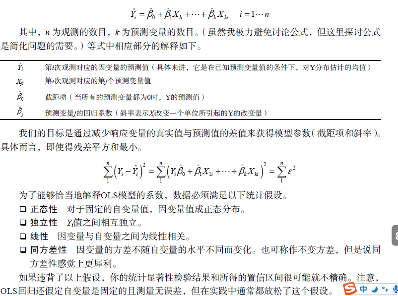
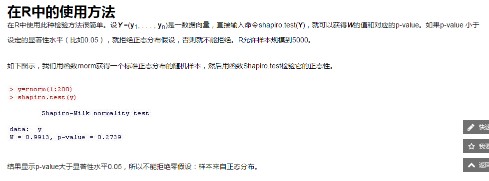
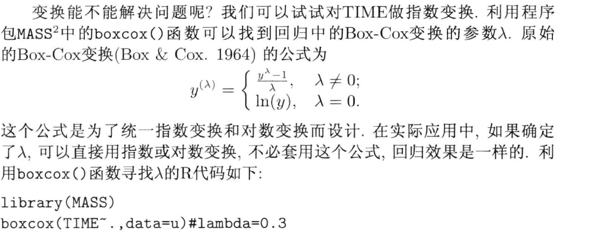
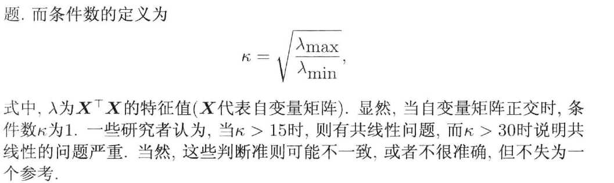
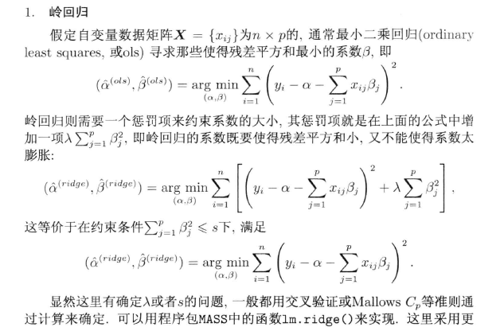
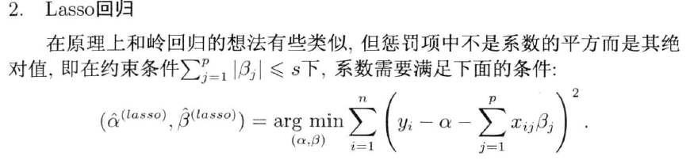
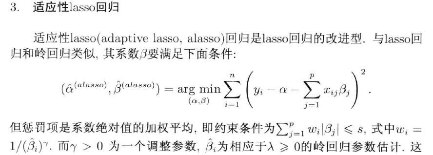

<!-- TOC depthFrom:1 depthTo:6 withLinks:1 updateOnSave:1 orderedList:0 -->

- [横截面数据： 因变量为实数轴上的数量变量](#横截面数据-因变量为实数轴上的数量变量)
	- [简单的回归分析](#简单的回归分析)
	- [最小二乘法(OLS)：](#最小二乘法ols)
		- [正态性检验](#正态性检验)
		- [模型评价](#模型评价)
			- [模型选择](#模型选择)
	- [简单线性模型不易处理的横截面数据](#简单线性模型不易处理的横截面数据)
		- [生存数据---生存分析](#生存数据-生存分析)
			- [数据模型拟合](#数据模型拟合)
				- [简单的线性回归分析](#简单的线性回归分析)
				- [数据变换](#数据变换)
				- [生存分析数据的COX回归模型](#生存分析数据的cox回归模型)
	- [数据出现多重共线性：岭回归，lasso回归，适应性lasso回归，偏最小二乘回归](#数据出现多重共线性岭回归lasso回归适应性lasso回归偏最小二乘回归)
		- [多重共线性检验](#多重共线性检验)
		- [处理多重共线性几种回归方法](#处理多重共线性几种回归方法)
			- [岭回归](#岭回归)
			- [lasso回归](#lasso回归)
			- [适应性 lasso回归](#适应性-lasso回归)
			- [偏最小二乘回归](#偏最小二乘回归)
	- [无法做任何假定的数据：机器学习回归方法](#无法做任何假定的数据机器学习回归方法)

<!-- /TOC -->

# 横截面数据： 因变量为实数轴上的数量变量

## 简单的回归分析
##最小二乘法(OLS)：
假定因变量Y和自变量X满足线性回归模型，其方程为
$y = X\beta + \epsilon$
假设条件： Y 满足如下条件：
* 正态性 对于固定的自变量值，因变量值成正态分布。
* 独立性 Yi值之间相互独立。
* 线性 因变量与自变量之间为线性相关。
* 同方差性 因变量的方差不随自变量的水平不同而变化。

### 正态性检验
shapiro.test(y)
[Shapiro-Wilk (SW) 检验](http://blog.csdn.net/zzminer/article/details/8858469)
Shapiro-Wilk检验用于验证一个随机样本数据是否来自正态分布。
假设
设 Y1< Y2 < … < Yn 是数量是n的一个排序的样本，需要验证其是否符合正态分布。假设是：
H0: 样本数据与正态分布没有显著区别。
HA: 样本数据与正态分布存在显著区别。

###　模型评价
1.残差(误差)正态性检验
2.方差分析的F检验,根据p值
3.系数的t检验，根据p值
4.$R^2$ 可决系数

#### 模型选择
不断怀疑和探索是科学的态度
AIC 逐步回归、t检验、F检验

## 简单线性模型不易处理的横截面数据
为了使得线性模型所需要的正态性假设成立，常常对因变量使用指数变换或对数变换（其统一形式为Box-Cox变换），以使其接近正态分布形状。

### 生存数据---生存分析

####　数据模型拟合
#####　简单的线性回归分析
模型判定条件 $R^2$(可决系数) 和 Shapiro-Wilk 正态性检验

##### 数据变换
残差不满足正态分布，可数据变换

模型判定条件 $R^2$(可决系数) 和 Shapiro-Wilk 正态性检验、F检验是否显著

##### 生存分析数据的COX回归模型
生存数据分析的目的比较不同的处理方法及各种因素(变量)对生存函数的影响，而不是单纯的寻找拟合的模型；

## 数据出现多重共线性：岭回归，lasso回归，适应性lasso回归，偏最小二乘回归
在多元回归分析中，当两个或更多的自变量有些相关的时候，有看能会出现多重共线性，这时模型或数据微小的变化有可能造成系数估计的较大变化，使得模型结果不稳定，也不易解释；
###　多重共线性检验
容忍度(tolerance) 或 方差膨胀因子（VIF），而另一个是 条件数（condition number），常用 $\kappa$ 显示；

容忍度与VIF定义的公式如下：
$tolerance = 1 - R^2_j$

$VIF_j = \frac{1}{(1-R^2_j)}$

$R^2_j$是第j个变量在所有其他变量上回归时确定的系数，容忍度太小（按照一些文献，比如小于0.2或0.1）或VIF太大（比如大于5或者大于10），则有多重共线性问题

###　处理多重共线性几种回归方法
#### 岭回归

####　lasso回归

#### 适应性 lasso回归

####偏最小二乘回归

参考文章　[多重共线性](http://wiki.pinggu.org/doc-view-29773.html)

解决办法：
1：逐步回归法：剔除变量

2：岭回归方法：有偏估计

3：主成分分析：降维，提取信息

4：偏最小二乘回归法（pls）：原理与主成分方法相似

5.差分法

6.重新定义方程

## 无法做任何假定的数据：机器学习回归方法
机器学习方法对数据没有任何假定，产生的结果用交叉验证方法判断；
