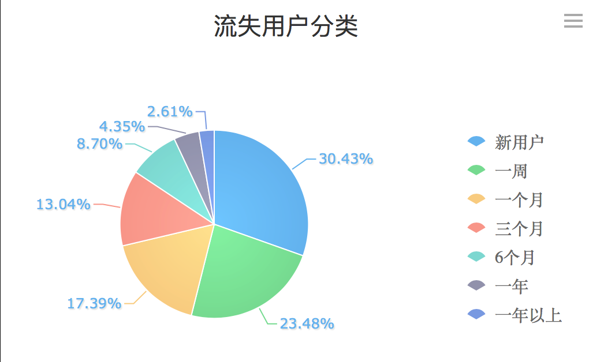
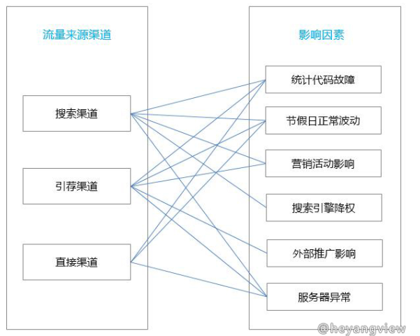

<!-- toc orderedList:0 depthFrom:1 depthTo:6 -->

* [问题1：分析并提高流量的方法](#问题1分析并提高流量的方法)
  * [搜索流量(关键词)：](#搜索流量关键词)
  * [排行榜商品榜；](#排行榜商品榜)
  * [渠道来源分析](#渠道来源分析)
  * [流量着陆页分析--店内路径分析](#流量着陆页分析-店内路径分析)
  * [访问时间及低于](#访问时间及低于)
  * [商品套餐](#商品套餐)
  * [运营活动](#运营活动)
  * [渠道广告](#渠道广告)
* [具体描述下用户画像内容](#具体描述下用户画像内容)
  * [是什么](#是什么)
  * [怎么用](#怎么用)
  * [用户画像用途](#用户画像用途)
  * [工作中的运用：](#工作中的运用)
* [需要对用户流失进行分析，请说说你的思路](#需要对用户流失进行分析请说说你的思路)
  * [流失用户分类，明确流失用户群体](#流失用户分类明确流失用户群体)
  * [新用户流失](#新用户流失)
  * [老用户流失：](#老用户流失)
  * [渠道流失分析](#渠道流失分析)
  * [商品流失分析](#商品流失分析)
* [页面流量突然下降，请说说你的分析思路](#页面流量突然下降请说说你的分析思路)
  * [流量统计自生问题](#流量统计自生问题)
  * [运营活动结束，导致流量回落](#运营活动结束导致流量回落)
  * [流量渠道 投放结束，导致流量下降](#流量渠道-投放结束导致流量下降)
* [一堆商品中销售量有高有低，请分析如何使高销量的商品销量更好，低销量商品销量变高](#一堆商品中销售量有高有低请分析如何使高销量的商品销量更好低销量商品销量变高)
  * [高销量更好](#高销量更好)
  * [销售低商品](#销售低商品)
  * [高销量商品和低销量商品，找到工作，做关联销售，做活动](#高销量商品和低销量商品找到工作做关联销售做活动)

<!-- tocstop -->

## 问题1：分析并提高流量的方法
### 搜索流量(关键词)：
选择热门关键词，设置容易被搜索到关键词，增加流量
### 排行榜商品榜；
让商品进入排行榜，增加曝光度，提高商品流量
### 渠道来源分析
渠道占比分析，什么渠道占比重，什么渠道有上升的趋势，什么渠道下降了
### 流量着陆页分析--店内路径分析
从什么地方来的，访问了什么页面，干了什么事，之后又干什么了
### 访问时间及低于
什么时间段是访问高峰期，什么地域访问人数多
### 商品套餐
商品关联销售，推荐商品，套餐商品，让顾客多访问商品，多停留；
### 运营活动
针对增加流量，做一个专题活动，推动流量短期上升
### 渠道广告
增加曝光度，依据用户画像，进行重点投放；

----
## 具体描述下用户画像内容
### 是什么
用户画像是对用户属性的描述，核心工作即是给用户贴“标签”，抽象出的一个标签化的用户模型，将用户群体进行区分，群体内部相似，群体之外有差异；
### 怎么用
具体到应该场景就是用户性别、年龄、地域、会员等级，职业分布，下单时间段，手机系统，喜好品牌，购买能力；
###　划分
寻找关键变量，对目标用户/客户进行聚类分析；
###  用户画像用途
1.精准营销，分析产品潜在用户，针对特定群体利用短信邮件等方式进行营销；
2.数据挖掘，构建智能推荐系统，利用关联规则计算，喜欢红酒的人通常喜欢什么运动品牌，利用聚类算法分析，喜欢红酒的人年龄段分布情况；
3.进行效果评估，完善产品运营，提升服务质量，其实这也就相当于市场调研、用户调研，迅速下定位服务群体，提供高水平的服务；
4.业务经营分析以及竞争分析，影响企业发展战略

### 工作中的运用：
O2O 效果分析（分析报告中讲述）

## 需要对用户流失进行分析，请说说你的思路

### 流失用户分类，明确流失用户群体
### 新用户流失
从用户体验，产品是否满足用户需求分析
### 老用户流失：
老用户流失再细分，购买2次，3次，多长时间未购买
### 渠道流失分析
哪个渠道带来流量下降明显，导致用户流失
### 商品流失分析
哪个商品流向下降，导致用户流失

## 页面流量突然下降，请说说你的分析思路

### 　流量统计自生问题
1.数据统计错误
2.APP版本升级，流量统计代码未放正确
2.页面无法正常访问
###  运营活动结束，导致流量回落

###  流量渠道 投放结束，导致流量下降
[网站流量突然下降应该怎么找原因？](http://www.chinaz.com/web/2016/0704/547252.shtml)

[流量突然下降的六大原因及对策](http://mt.sohu.com/20160407/n443569620.shtml)

## 一堆商品中销售量有高有低，请分析如何使高销量的商品销量更好，低销量商品销量变高

### 高销量更好
1.分析高销量商品好的原因；
商品标题(关键词)、价格、目标群体、渠道来源
2.销售好商品存在的问题：
优化，提高
3.商品关联销售、推荐销售
4.渠道推广，打广告
5.做活动
### 销售低商品
1.原因分析，改进
2.借鉴高销量商品，销售好的方面，改进
3.和高销量商品 搭配销售
### 高销量商品和低销量商品，找到工作，做关联销售，做活动；
